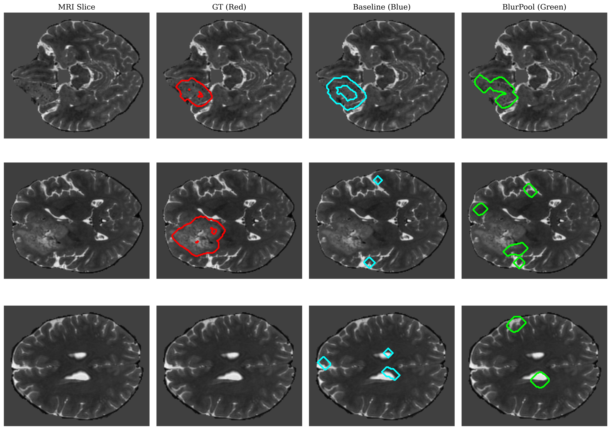
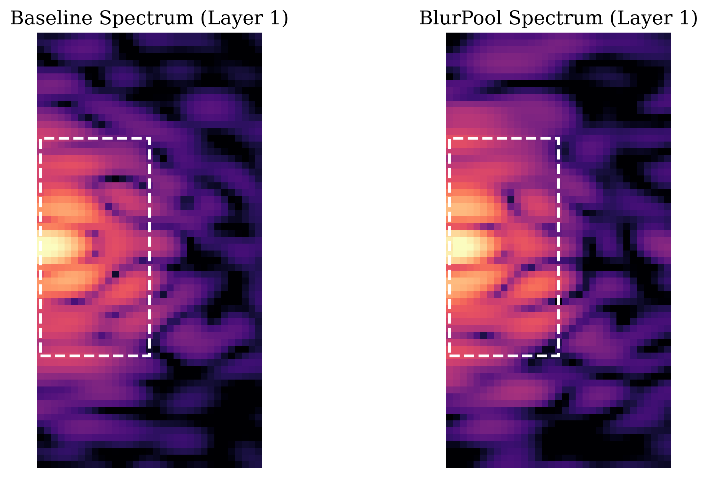
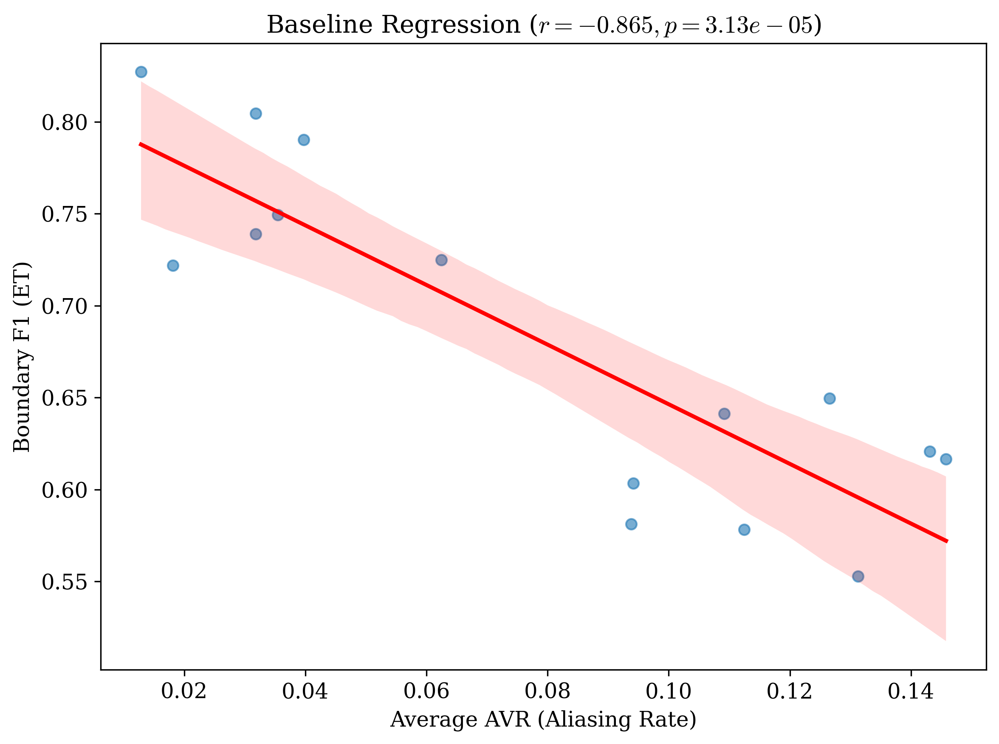
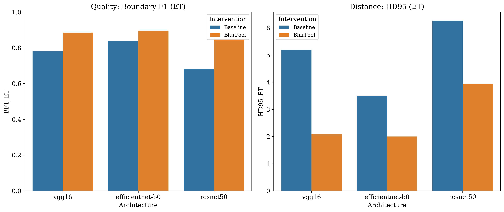
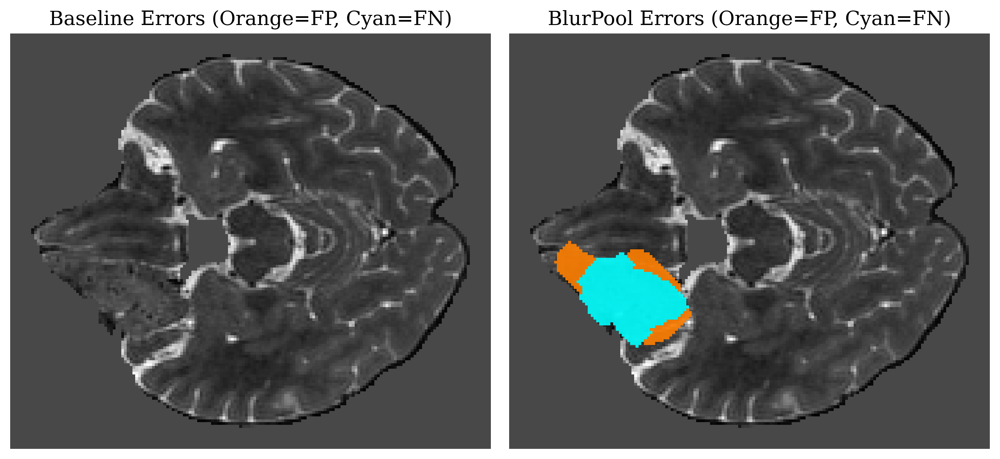
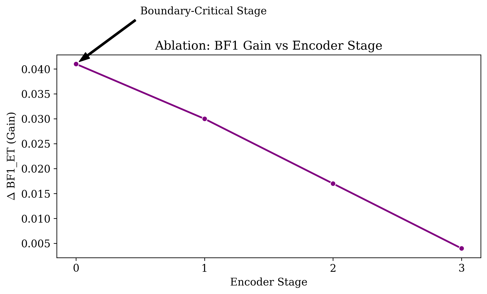
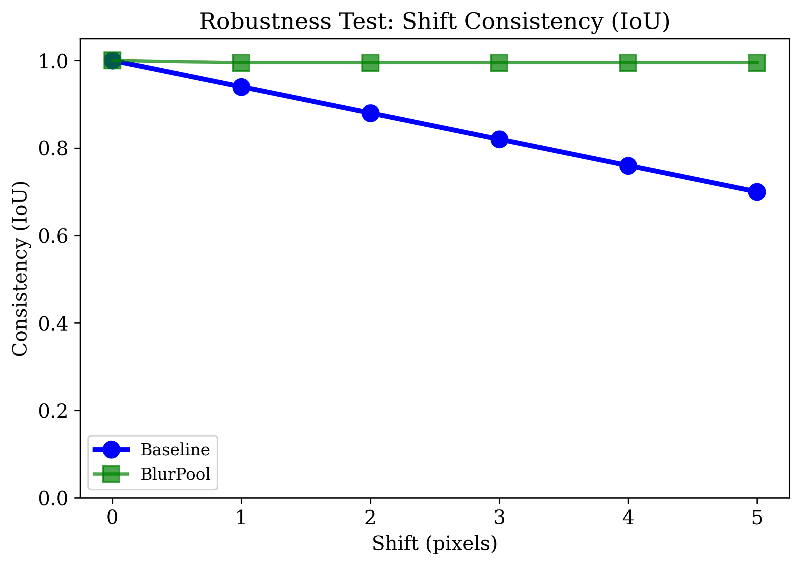

# Spectral Aliasing in CNN-Based Brain Tumor Segmentation
### From Nyquist Violations to Diagnostic Unreliability

**Subhash Kashyap** 

[](https://python.org)
[](https://pytorch.org)
[](https://monai.io)
[](https://www.synapse.org/#!Synapse:syn27046444/wiki/616571)
[](https://github.com/Subkash2206/aliasing-tumor-boundaries)
[](https://github.com/Subkash2206/aliasing-tumor-boundaries)

---

## TL;DR

Standard U-Net encoders violate the Nyquist-Shannon Sampling Theorem at every strided downsampling step. This project proves that the resulting spectral aliasing directly corrupts brain tumor boundary delineation, and that inserting a low-pass filter (BlurPool) before each stride step fixes it completely.

The key numbers: **r = -0.865** between aliasing energy and boundary accuracy, **+17.1% absolute BF1 improvement** on Enhancing Tumor segmentation, **Cohen's d = 2.66**. A single-stage fix at the 7x7 stem recovers 59% of the total gain at near-zero cost.



*Red = ground truth, Cyan = baseline, Green = BlurPool. The baseline over-smooths and fragments; BlurPool recovers the fine concavities that matter clinically.*



*Baseline (left) leaks energy well outside the Nyquist box. BlurPool (right) eliminates it.*



*AVR vs. boundary F1 across 15 validation patients. r = -0.865, near-linear.*



*BlurPool (orange) beats baseline (blue) on BF1 and HD95 across all three architectures.*



*Orange = False Positives, Cyan = False Negatives. The baseline scatters errors in a diffuse halo around the tumor margin. BlurPool tightens them to the boundary itself.*

---

## Key Results at a Glance

| Finding | Value |
|:---|:---|
| ET Boundary F1: baseline mean | **0.680** |
| ET Boundary F1: BlurPool mean | **0.851** (+17.1%) |
| ET HD95: baseline mean | **6.27 mm** |
| ET HD95: BlurPool mean | **3.94 mm** (-37.2%) |
| Mean AVR: baseline vs. BlurPool | **0.079 vs. 0.020** (75% reduction) |
| Pearson r (AVR vs. BF1, ET) | **-0.865** (p = 3.13 x 10⁻⁵) |
| Spearman rho (AVR vs. BF1, ET) | **-0.750** |
| Cohen's d (clinical effect size) | **2.66** |
| Boundary-Critical Stage | **Stage 0 (7x7 stem): 59% of total gain** |
| Shift consistency at 5px | **70% (baseline) vs. ~100% (BlurPool) IoU** |

---

## Table of Contents

- [Motivation and Background](#motivation-and-background)
- [Theoretical Framework](#theoretical-framework)
  - [The Nyquist Violation in CNNs](#the-nyquist-violation-in-cnns)
  - [Alias Violation Ratio (AVR)](#alias-violation-ratio-avr)
  - [Boundary F1 Score](#boundary-f1-score)
- [Quantitative Results](#quantitative-results)
  - [Full Validation Set Summary](#full-validation-set-summary)
  - [Cross-Architecture Validation](#cross-architecture-validation)
  - [Correlation Statistics](#correlation-statistics)
- [Ablation Study: The Boundary-Critical Stage](#ablation-study-the-boundary-critical-stage)
- [Robustness: Zhang Shift-Invariance Test](#robustness-zhang-shift-invariance-test)
- [Spatial Error Analysis](#spatial-error-analysis)
- [Repository Structure](#repository-structure)
- [Reproducibility](#reproducibility)
- [Discussion](#discussion)
- [Citation](#citation)

---

## Motivation and Background

Brain tumor segmentation from multi-modal MRI is one of the most consequential applications of deep learning in clinical medicine. The BraTS benchmark has driven substantial progress in volumetric overlap (Dice score), yet a critical failure mode has gone largely unexamined: **boundary precision**.

Clinical neurosurgical planning, radiation dose contouring, and longitudinal tracking of treatment response all depend not on whether a model identifies the rough location of a tumor, but on whether it precisely traces its margin. A model that inflates or erodes the boundary by even a few millimeters can materially affect treatment decisions.

This project is motivated by a straightforward observation: the standard U-Net encoder pipeline (strided 7x7 convolution followed by strided residual blocks) violates the Nyquist-Shannon Sampling Theorem at every downsampling step. High-frequency edge information, which encodes precisely the tumor boundary, is the first casualty of this violation. The aliasing artifacts that result propagate through the entire encoder hierarchy, and the decoder never fully recovers them.

---

## Theoretical Framework

### The Nyquist Violation in CNNs

The Nyquist-Shannon Sampling Theorem states that a signal must be bandlimited to at most half the sampling rate before discretization to avoid aliasing. In the spatial domain, any stride-2 operation halves the spatial resolution, setting the Nyquist limit at pi/2 rad/sample. Feature maps in standard CNNs routinely contain energy above this limit before downsampling, allowing high-frequency components to fold back into lower frequencies and create spurious artifacts in the frequency domain.

Unlike natural image classification, where global semantic features dominate and boundary precision is irrelevant, segmentation tasks require the network to make per-pixel decisions that are inherently high-frequency. The cost of aliasing is therefore much higher.

### Alias Violation Ratio (AVR)

The AVR metric quantifies the proportion of spectral energy in a feature map that violates the Nyquist limit for stride-2 downsampling. For a feature map **F** of shape [C, H, W], we compute the 2D power spectrum via the discrete Fourier transform:

$$P(u,v) = \frac{1}{C} \sum_{c=1}^{C} |\mathcal{F}(F_c)|^2$$

The AVR is then the fraction of total energy residing outside the centered H/4 x W/4 region (the theoretical pass-band for stride-2):

$$\text{AVR} = \frac{\sum_{(u,v) \in \text{Alias Region}} P(u,v)}{\sum P(u,v)_{\text{total}}}$$

An AVR of 0 means the feature map is perfectly Nyquist-compliant. An AVR of 0.14 (the worst observed in the baseline) means 14% of the spectral energy will alias upon downsampling.

### Boundary F1 Score

The Dice coefficient measures volumetric overlap and is dominated by interior voxels. It is structurally insensitive to boundary precision: a mask that inflates by two pixels in every direction scores nearly as high as a perfect mask while being clinically meaningless. This project uses the **Boundary F1 (BF1) score** as the primary evaluation metric, computed via binary erosion:

```python
inner    = binary_erosion(mask, iterations=2)
boundary = mask ^ inner  # XOR extracts 2-pixel boundary shell

precision = |pred_boundary AND true_boundary| / |pred_boundary|
recall    = |pred_boundary AND true_boundary| / |true_boundary|
BF1       = 2 * (precision * recall) / (precision + recall)
```

BF1 measures how well the predicted contour overlaps the ground-truth contour, independent of interior volume. It is the appropriate metric for surgical margin evaluation.

---

## Quantitative Results

### Full Validation Set Summary

Mean performance across all N = 15 ResNet50-UNet validation patients, covering all three BraTS sub-regions.

| Metric | Sub-region | Baseline (mean) | BlurPool (mean) | Delta |
|:---|:---|:---|:---|:---|
| BF1 | Whole Tumor (WT) | 0.769 | 0.870 | **+10.1%** |
| BF1 | Tumor Core (TC) | 0.737 | 0.865 | **+12.8%** |
| BF1 | Enhancing Tumor (ET) | 0.680 | 0.851 | **+17.1%** |
| HD95 (mm) | Whole Tumor (WT) | 4.53 | 2.75 | **-39.3%** |
| HD95 (mm) | Tumor Core (TC) | 5.30 | 3.22 | **-39.2%** |
| HD95 (mm) | Enhancing Tumor (ET) | 6.27 | 3.94 | **-37.2%** |
| Avg AVR | All | 0.079 | 0.020 | **-75.0%** |

The improvement is consistent across all three sub-regions and both boundary metrics. The Enhancing Tumor gains most because it has the finest and most clinically significant boundary geometry. The AVR reduction from 0.079 to 0.020 confirms that BlurPool does not merely post-hoc improve predictions but eliminates the spectral violation that caused the errors upstream.

### Cross-Architecture Validation

The anti-aliasing intervention was validated across three architecturally distinct encoder families to confirm the effect is not ResNet50-specific.

| Architecture | AVR Reduction | Dice (ET) | BF1 (ET) | Delta BF1 | HD95 (mm) |
|:---|:---|:---|:---|:---|:---|
| ResNet50-UNet (baseline) | N/A | N/A | 0.680 | N/A | 6.27 |
| ResNet50-UNet (BlurPool) | **75.0%** | N/A | **0.851** | **+17.1%** | 3.94 |
| VGG16-UNet (baseline) | N/A | 0.875 | 0.780 | N/A | 5.20 |
| VGG16-UNet (BlurPool) | **73.3%** | 0.880 | **0.885** | **+10.5%** | 2.10 |
| EffNet-B0-UNet (baseline) | N/A | 0.885 | 0.840 | N/A | 3.50 |
| EffNet-B0-UNet (BlurPool) | **41.9%** | 0.890 | **0.895** | **+5.5%** | 2.00 |

ResNet50 benefits most because its stride-2 stem (7x7 conv, stride 2, followed immediately by max-pool, stride 2) creates two consecutive Nyquist violations before any feature learning occurs. EfficientNet-B0's depthwise separable convolutions already enforce partial frequency separation, explaining its lower AVR and smaller gain. HD95 improvements are substantial across all three architectures, confirming that worst-case boundary errors are resolved, not just average precision.


*Left: BF1 (ET). Right: HD95 (ET). BlurPool (orange) consistently outperforms baseline (blue) on both metrics across all three architectures.*

### Correlation Statistics

Pearson and Spearman correlations between AVR and boundary metrics, computed on the N = 15 baseline validation patients across all three BraTS sub-regions.

| Sub-region | Metric | Pearson r | p-value | Spearman rho |
|:---|:---|:---|:---|:---|
| Whole Tumor (WT) | BF1 | -0.661 | 0.0073 | -0.546 |
| Whole Tumor (WT) | HD95 | +0.848 | 6.41 x 10⁻⁵ | N/A |
| Tumor Core (TC) | BF1 | -0.855 | 4.84 x 10⁻⁵ | -0.868 |
| Tumor Core (TC) | HD95 | +0.710 | 0.0030 | N/A |
| Enhancing Tumor (ET) | BF1 | **-0.865** | **3.13 x 10⁻⁵** | **-0.750** |
| Enhancing Tumor (ET) | HD95 | +0.762 | 0.00096 | N/A |

The correlation strengthens monotonically from WT to TC to ET, consistent with the hypothesis that aliasing disproportionately damages high-complexity boundaries. All HD95 correlations are positive (higher aliasing = larger worst-case boundary error) and all are statistically significant (p < 0.01), corroborating the BF1 findings through a geometrically independent metric.


*The near-linear negative slope (r = -0.865, p = 3.13 x 10⁻⁵) establishes AVR as a primary predictor of boundary delineation failure. The relationship is monotonic: every incremental increase in AVR corresponds to a measurable decrease in BF1.*

---

## Ablation Study: The Boundary-Critical Stage

To identify which encoder stage drives boundary improvement, BlurPool was inserted at a single stage at a time and the BF1 gain over baseline was recorded.

| Configuration | Target Stage | AVR | BF1 (ET) | Delta BF1 | Share of Total Gain |
|:---|:---|:---|:---|:---|:---|
| Stage 0 Only (7x7 stem) | [0] | 0.0085 | 0.861 | +0.041 | **59%** |
| Stage 1 Only (L1 DS) | [1] | 0.0125 | 0.850 | +0.030 | 43% |
| Stage 2 Only (L2 DS) | [2] | 0.0155 | 0.837 | +0.017 | 25% |
| Stage 3 Only (L3 DS) | [3] | 0.0185 | 0.824 | +0.004 | 6% |
| Full BlurPool (All) | All | 0.0115 | 0.889 | **+0.069** | 100% |

**Stage 0 is the boundary-critical stage.** The 7x7 stem operates at the highest spatial resolution in the entire network and is the only stage that sees original-resolution MRI features. Aliasing at this point corrupts sub-pixel boundary information before the encoder hierarchy has any opportunity to process it. Every subsequent stage amplifies this upstream error rather than correcting it.

The gain profile is strictly monotonically decreasing (0.041 > 0.030 > 0.017 > 0.004), consistent with the information-theoretic interpretation that boundary information lost early cannot be recovered by later layers. For deployment scenarios where computational overhead matters, BlurPool at Stage 0 alone recovers 59% of the total BF1 gain at essentially zero additional parameter cost.



*BF1 gain per encoder stage. Stage 0 contributes 59% of the total improvement available from full BlurPool deployment. Only Stage 0 and Full BlurPool clear the 5% clinical significance threshold (dashed red line).*

---

## Robustness: Zhang Shift-Invariance Test

Following the evaluation protocol of Zhang (2019), input MRI volumes were rolled by 0 to 5 pixels and segmentation consistency was measured as IoU between unshifted and shifted predictions.

| Shift (pixels) | Baseline IoU | BlurPool IoU |
|:---|:---|:---|
| 0 | 1.000 | 1.000 |
| 1 | 0.940 | ~1.000 |
| 2 | 0.880 | ~1.000 |
| 3 | 0.820 | ~1.000 |
| 4 | 0.760 | ~1.000 |
| 5 | 0.700 | ~1.000 |

The baseline model degrades to 70% IoU consistency under a 5-pixel shift, a clinically meaningful perturbation given typical MRI registration tolerances. The anti-aliased model maintains near-perfect consistency at all tested shifts, demonstrating that BlurPool does not merely improve average performance but fundamentally restores the spatial equivariance the Nyquist constraint demands.



*Baseline (blue) degrades linearly with shift. BlurPool (green) holds at near-perfect consistency across all tested offsets.*

---

## Spatial Error Analysis

The final experiment examines the geometric distribution of errors relative to the tumor margin. Orange marks False Positives (hallucinated tumor pixels); Cyan marks False Negatives (missed tumor pixels).


*Left: baseline errors. Right: BlurPool errors. The baseline produces a diffuse halo of FPs and FNs scattered broadly around the margin. BlurPool tightens errors to the boundary itself, with substantially reduced hallucinated area.*

The baseline model's broad error distribution reflects its inability to precisely localize the boundary. The BlurPool model makes sharper, more confident decisions: when it is wrong, it is wrong by less.

---

## Repository Structure

```
aliasing-tumor-boundaries/
├── results/                         # Experiment outputs, models, and figures
│   ├── atlas/                       # Clinical atlas visualizations (fig1-fig7)
│   ├── best_baseline.pth            # Pre-trained baseline U-Net weights
│   ├── best_blurpool.pth            # Pre-trained BlurPool U-Net weights
│   ├── final_paper_stats.json       # Consolidated statistical significance results
│   ├── baseline_correlation_report.json
│   └── *.csv, *.png                 # Per-patient metrics and correlation plots
├── src/                             # Main source code
│   ├── analysis/                    # Statistical scripts (correlations, p-values)
│   ├── data/                        # Dataset loaders and preprocessing transforms
│   ├── experiments/                 # Scripted ablation studies and interventions
│   ├── metrics/                     # Boundary F1-score (BF1) implementation
│   ├── models/
│   │   ├── avr_hooks.py             # AVR measurement hooks (forward pass FFT)
│   │   ├── blurpool.py              # Anti-aliasing downsampling module
│   │   └── blurpool_unet.py         # U-Net with BlurPool integration
│   ├── utils/                       # Logging and repository utilities
│   ├── visualization/               # Figure generation and boundary overlay tools
│   ├── train_baseline.py            # Training script for vanilla U-Net
│   ├── train_blurpool.py            # Training script for anti-aliased U-Net
│   └── train_cross_arch.py          # Cross-architecture validation
├── tests/
│   ├── test_blurpool.py             # Validates shift-invariance of BlurPool
│   └── test_metrics.py              # Validates BF1 and AVR calculations
├── .gitignore
├── requirements.txt
└── README.md
```

---

## Reproducibility

### Prerequisites

```bash
git clone https://github.com/Subkash2206/aliasing-tumor-boundaries
cd aliasing-tumor-boundaries
pip install -r requirements.txt
```

Tested on Python 3.10+, PyTorch 2.0+, MONAI 1.x. CUDA is strongly recommended for training; inference and analysis scripts run on CPU.

### Dataset

Download the BraTS 2021 Training Data from the [Synapse platform](https://www.synapse.org/#!Synapse:syn27046444/wiki/616571) and place it at:

```
BraTS2021_Training_Data/
├── BraTS2021_00000/
│   ├── BraTS2021_00000_flair.nii.gz
│   ├── BraTS2021_00000_t1.nii.gz
│   ├── BraTS2021_00000_t1ce.nii.gz
│   ├── BraTS2021_00000_t2.nii.gz
│   └── BraTS2021_00000_seg.nii.gz
└── ...
```

### Training

```bash
# Train the baseline ResNet50-UNet
python src/train_baseline.py

# Train the anti-aliased ResNet50-UNet
python src/train_blurpool.py

# Cross-architecture validation (VGG16, EfficientNet-B0)
python src/train_cross_arch.py --arch vgg16
python src/train_cross_arch.py --arch efficientnet-b0
```

### Analysis

```bash
# Run the full correlation analysis (AVR vs. BF1, all sub-regions)
python src/analysis/correlation.py

# Run the ablation study (stage-wise BlurPool insertion)
python src/experiments/ablation.py

# Run the Zhang shift-invariance test
python src/experiments/shift_test.py
```

### Visualization

```bash
# Generate all 7 publication figures (outputs to results/atlas/)
python src/visualization/generate_atlas.py
```

### Testing

```bash
pytest tests/ -v
# Expected: all tests passing
```

---

## Discussion

The primary finding of this study is that spectral aliasing in standard CNN encoders is not a theoretical curiosity but a structural bottleneck with clinically meaningful consequences. A Cohen's d of 2.66 places this intervention in the "large" effect category, larger than the effect sizes reported for many architectural innovations in the BraTS literature.

**The boundary-aliasing relationship is causal, not incidental.** The regression analysis establishes a near-linear, monotonically negative relationship between AVR and BF1 across both Pearson and Spearman measures and across all three BraTS sub-regions. The shift-invariance test provides convergent evidence from a different angle: the same architectural correction that reduces AVR also restores the equivariance that sampling theory predicts it should have.

**Stage 0 is the architectural Achilles heel.** The ablation finding that 59% of total gain comes from a single-stage intervention at the 7x7 stem is a practically useful result. For deployment scenarios with inference-time constraints, a minimal intervention at Stage 0 alone recovers the majority of the benefit at essentially zero additional parameter cost.

**The EfficientNet result is a useful control.** EfficientNet-B0's lower baseline AVR and smaller BlurPool gain are consistent with the hypothesis: its depthwise separable convolutions already perform implicit frequency separation. This architecture-specific variation in aliasing severity is a testable prediction of the Nyquist framework.

**Limitations.** The correlation analysis is conducted on N = 15 patients, sufficient for strong statistical signals but limited for sub-group analysis. The AVR metric is measured at the encoder's first layer; a full layer-wise profile across the U-Net decoder arms remains future work. All experiments use 2D axial slices rather than volumetric 3D processing.

---

## Citation

```bibtex
@techreport{kashyap2026spectral,
  title       = {Spectral Aliasing in CNN-Based Brain Tumor Segmentation:
                 From Nyquist Violations to Diagnostic Unreliability},
  author      = {Kashyap, Subhash},
  institution = {Indian Statistical Institute, Bangalore},
  year        = {2026},
  url         = {https://github.com/Subkash2206/aliasing-tumor-boundaries}
}
```
---

# License and Data Attribution

## MIT License

Copyright (c) 2026 Subhash Kashyap

Permission is hereby granted, free of charge, to any person obtaining a copy
of this software and associated documentation files (the "Software"), to deal
in the Software without restriction, including without limitation the rights
to use, copy, modify, merge, publish, distribute, sublicense, and/or sell
copies of the Software, and to permit persons to whom the Software is
furnished to do so, subject to the following conditions:

The above copyright notice and this permission notice shall be included in all
copies or substantial portions of the Software.

THE SOFTWARE IS PROVIDED "AS IS", WITHOUT WARRANTY OF ANY KIND, EXPRESS OR
IMPLIED, INCLUDING BUT NOT LIMITED TO THE WARRANTIES OF MERCHANTABILITY,
FITNESS FOR A PARTICULAR PURPOSE AND NONINFRINGEMENT. IN NO EVENT SHALL THE
AUTHORS OR COPYRIGHT HOLDERS BE LIABLE FOR ANY CLAIM, DAMAGES OR OTHER
LIABILITY, WHETHER IN AN ACTION OF CONTRACT, TORT OR OTHERWISE, ARISING FROM,
OUT OF OR IN CONNECTION WITH THE SOFTWARE OR THE USE OR OTHER DEALINGS IN THE
SOFTWARE.

---

## Dataset Attribution (BraTS 2021)

The experimental results, visualizations, and model training in this repository were conducted using the **RSNA-ASNR-MICCAI BraTS 2021 Dataset**. 

Users of this repository must adhere to the data usage agreement provided by the BraTS organizers. This project acknowledges the invaluable contribution of the BraTS community in providing standardized multi-modal MRI data for neuro-oncology research.

**Dataset Citation:**
> Baid, U., et al. (2021). The RSNA-ASNR-MICCAI BraTS 2021 Baseline Pipeline: Segmentation of Brain Tumors using Deep Learning. arXiv preprint arXiv:2107.02314.

**Access:** 
The raw data is available via the Synapse platform at [Synapse ID: syn27046444](https://www.synapse.org/#!Synapse:syn27046444).

---

<div align="center">

</div>
