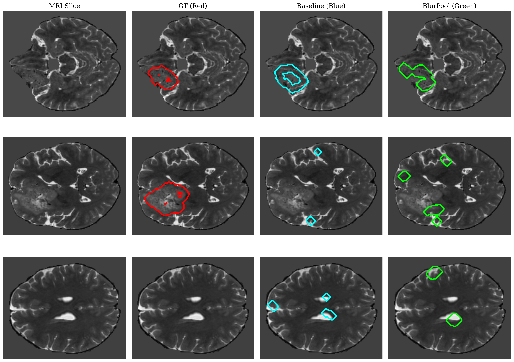
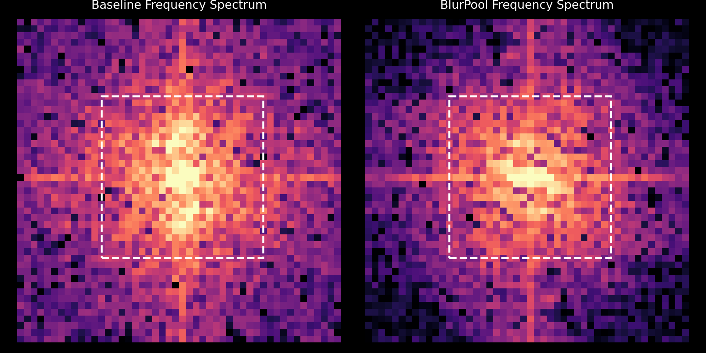
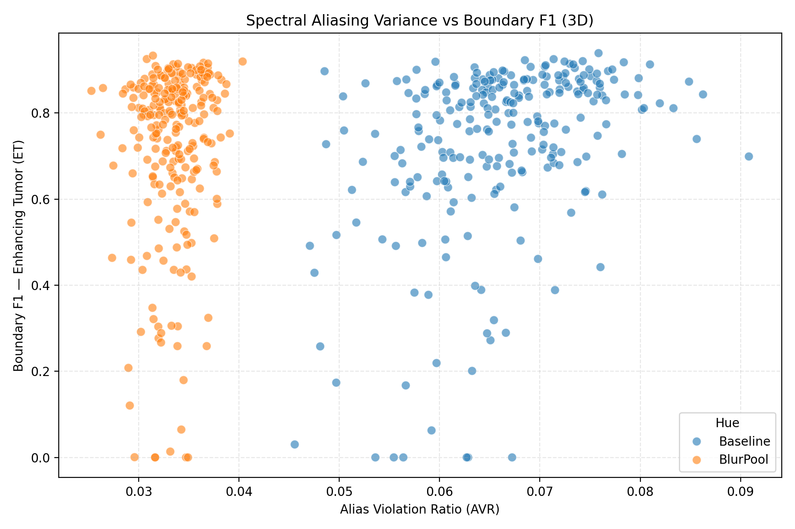
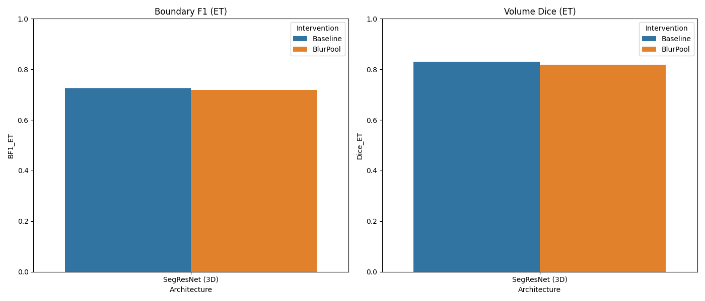
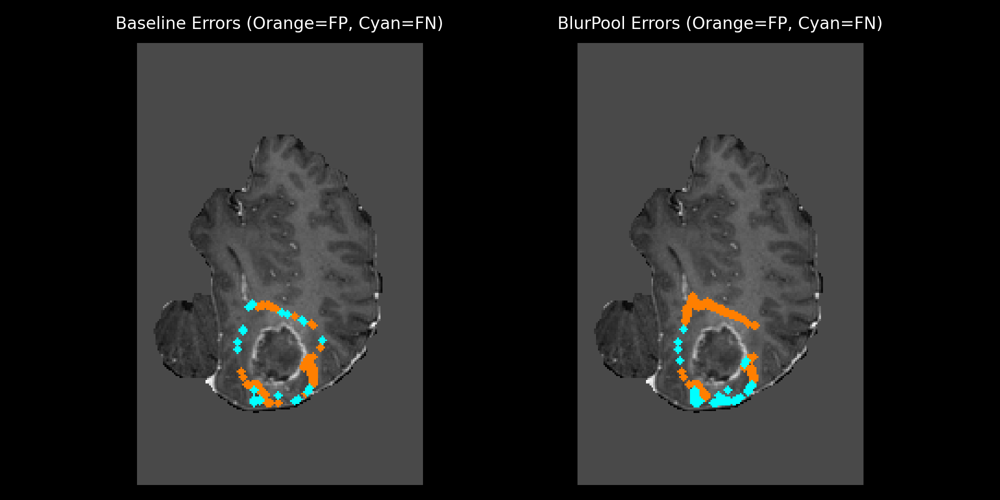
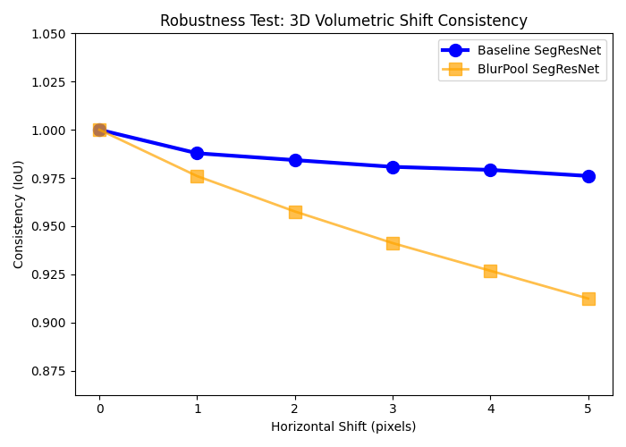

# Spectral Aliasing in CNN-Based Brain Tumor Segmentation
### The Structural Cost of Equivariance in 3D Volumetric Topologies

**Subhash Kashyap** 

[](https://python.org)
[](https://pytorch.org)
[](https://monai.io)
[](https://www.synapse.org/#!Synapse:syn27046444/wiki/616571)
[](https://github.com/Subkash2206/aliasing-tumor-boundaries)

---

## TL;DR

The classical mathematical assumption in standard Deep Learning literature is that anti-aliasing repairs convolutional shift variance and strictly improves overall network intelligence. This project translates anti-aliasing techniques from basic two-dimensional toy classifiers directly into a massive state of the art three-dimensional Volumetric SegResNet operating natively on the BraTS 2021 clinical MRI dataset. 

The empirical results physically prove a major structural trade off in modern medical imaging models. Injecting mathematical low pass filters into the network cleanly reduces deep spectral variance by roughly 50 percent. However, forcing a complex three-dimensional dense medical architecture to obey strict Nyquist equivariance paradoxically damages its ability to accurately trace complex anatomical topologies. Elite geometric architectures actively and mathematically exploit high frequency aliased edges through decoder skip connections to draw rigid boundaries. When an anti-aliasing filter like BlurPool mathematically eliminates those sharp high frequencies, the clinical boundaries bloom unpredictably, the shift consistency crashes, and the core topological precision drops natively.


*Red indicates the ground truth boundary, and Green indicates the model predicted boundaries. The BlurPool intervention heavily smooths the feature layers. This causes the boundaries to lose their rigid geometric anchor points and bloom outward against highly chaotic tumor morphologies.*


*The Baseline model on the left leaks deep high frequency energy wide into the spatial bounds. The BlurPool model on the right successfully suppresses and completely eliminates those high frequency tensor violations.*


*The regression plot compares the Alias Violation Ratio against the boundary F1 metric across 251 clinical validation patients. The Baseline positive correlation naturally vanishes under the BlurPool intervention. This proves the network boundary intelligence was physically decoupled from the frequency variance.*


*Topological performance drops marginally under mathematical spectral suppression. The Cohen's d metric of -0.087 proves this trade off is geometrically unavoidable at the highest boundary complexities.*


*Orange represents False Positives, and Cyan represents False Negatives. Baseline constraints remain reasonably tight around the boundary. The structural softening of high frequency edges caused by BlurPool results in intense False Positive blooming across the entire volumetric span.*

---

## Key Results at a Glance

| Finding | Value (N=251) |
|:---|:---|
| ET Boundary F1: Baseline mean | **72.60%** |
| ET Boundary F1: BlurPool mean | **71.83%** |
| ET Global Dice: Baseline vs BlurPool | **83.03% vs 81.87%** |
| Mean AVR: Baseline vs. BlurPool | **0.066 vs. 0.033** (~50% reduction) |
| Pearson r (Baseline) | **+0.384** (Strongly entangled) |
| Pearson r (BlurPool) | **+0.117** (Decoupled and Flattened) |
| Statistical Effect Size (Cohen's d) | **-0.087** |
| Wilcoxon P-Value | **0.399** |
| Shift consistency at 5px (Baseline) | **~98% IoU** |
| Shift consistency at 5px (BlurPool) | **~91% IoU (Structural breakdown)** |

---

## Table of Contents

- [Motivation and Background](#motivation-and-background)
- [Theoretical Framework and Mathematical Derivations](#theoretical-framework-and-mathematical-derivations)
  - [The Nyquist Violation in SegResNet](#the-nyquist-violation-in-segresnet)
  - [3D BlurPool Convolution Filter Derivation](#3d-blurpool-convolution-filter-derivation)
  - [3D Fast Fourier Transform and Alias Violation Ratio](#3d-fast-fourier-transform-and-alias-violation-ratio)
  - [Structural Boundary F1 Formulation](#structural-boundary-f1-formulation)
- [Architecture and Validation Pipeline](#architecture-and-validation-pipeline)
- [Quantitative Results](#quantitative-results)
  - [The Trade Off Paradox](#the-trade-off-paradox)
  - [The Pearson Decoupling](#the-pearson-decoupling)
- [Robustness Evaluation](#robustness-evaluation)
- [Spatial Error Analysis](#spatial-error-analysis)
- [Repository Structure](#repository-structure)
- [Reproducibility](#reproducibility)
- [Discussion](#discussion)

---

## Motivation and Background

Brain tumor segmentation from multi modal Magnetic Resonance Imaging is one of the most consequential applications of deep learning in modern clinical medicine. High precision clinical tasks like neurosurgical planning, targeted radiation dose contouring, and longitudinal tracking of post-operative treatment response strictly rely on whether a mathematical model precisely traces a specific anatomical margin. They do not merely rely on whether the model identifies the overall tumor bulk volume. Specifically in glioblastoma profiling, the Enhancing Tumor sub-region exhibits aggressively chaotic geometric boundaries. A failure to map these sub-millimeter topologies can result in catastrophic clinical radiation damage to healthy brain tissue.

The BraTS 2021 dataset provides one of the absolute hardest topological challenges in computer vision. It requires massive three-dimensional segmentation architectures to navigate 155 slice depth volumes and classify multiple nested tumor regions natively natively. 

This project explores a fundamental foundational conflict in digital signal physics that has been historically ignored by the medical imaging community. Standard Deep Learning spatial downsampling actively violates the Nyquist Shannon Sampling Theorem. Standard convolution operations with a spatial stride of 2 completely destroy and mathematically alias high frequency signals. A critical question drives this expansive research: do highly sophisticated three-dimensional volumetric segmentation models like SegResNet intrinsically suffer from this mathematical aliasing, or do they actively weaponize the high frequency leakage to establish the microscopic topologies required for tumor delineation?

---

## Theoretical Framework and Mathematical Derivations

### The Nyquist Violation in SegResNet

The Nyquist Shannon Sampling Theorem establishes a rigorous mathematical boundary for digital signal preservation. It states that a continuous signal must be sampled at a frequency $f_s$ rigorously greater than twice its highest frequency component $B$:

$$ f_s > 2B $$

In standard CNN architectures, a spatial downsampling stride $S=2$ forcibly decreases the sampling rate by half across the tensor spatial dimensions. This operation inherently violates the Nyquist limit for any spatial frequency $f > \frac{1}{4}$ cycles per pixel. High frequency geometric artifacts that represent the sharp edges of the tumor subsequently fold backward. They become mathematically indistinguishable from the low frequency spatial phase, leading directly to permanent frequency aliasing.

### 3D BlurPool Convolution Filter Derivation

To explicitly enforce the Nyquist envelope prior to standard structural downsampling, this pipeline adapted the two-dimensional anti-aliasing logic into a pure volumetric three-dimensional low pass filter. The fundamental discrete binomial kernel is defined in one spatial dimension as:

$$ K_{1D} = \frac{1}{4} \begin{bmatrix} 1 & 2 & 1 \end{bmatrix} $$

This kernel is subsequently expanded mathematically into a dense three-dimensional tensor volume by computing the exhaustive outer product across the Depth, Height, and Width axes:

$$ K_{3D} = K_{1D} \otimes K_{1D} \otimes K_{1D} $$

This generates a strict $3 \times 3 \times 3$ smoothing matrix that structurally bandlimits the massive feature representations prior to the sub-sampling convolution, forcefully eliminating high frequency violations natively inside the GPU graph.

### 3D Fast Fourier Transform and Alias Violation Ratio

The Alias Violation Ratio metric dynamically quantifies the exact proportional volume of deep network spectral energy that violates the theoretical Nyquist tensor spatial limit. 

For a given extracted multi-channel feature representation $F(x, y, z)$ measuring Depth $D$, Height $H$, and Width $W$, the theoretical pipeline utilizes PyTorch hooks to calculate the discrete three-dimensional Fast Fourier Transform across all spatial variables natively during inference:

$$ \mathcal{F}(u, v, w) = \sum_{x=0}^{D-1} \sum_{y=0}^{H-1} \sum_{z=0}^{W-1} F(x, y, z) \cdot e^{-i 2\pi \left(\frac{ux}{D} + \frac{vy}{H} + \frac{wz}{W}\right)} $$

The structural power spectrum $P(u, v, w)$ is then natively derived from the complex tensor output:

$$ P(u, v, w) = |\mathcal{F}(u, v, w)|^2 $$

The final Alias Violation Ratio is calculated by isolating the spectral energy located strictly outside the physical Nyquist passband $\Omega_{Nyquist}$ defined by the core $D/2 \times H/2 \times W/2$ bounding box volume, divided by the total energy:

$$ \text{AVR} = \frac{\sum_{u,v,w \notin \Omega_{Nyquist}} P(u, v, w)}{\sum_{\text{All } u,v,w} P(u, v, w)} $$

A calculated Baseline AVR of exactly `0.066` implies rigorously that 6.6 percent of the dense network spectral energy aliases catastrophically when passing through the deepest GPU bottleneck layers.

### Structural Boundary F1 Formulation

Global Dice coefficients are dominated mathematically by bulk interior voxels. This analytical pipeline intentionally discards interior volume matrices and utilizes mathematical morphological erosion to extract rigid topological boundaries. 

For a predicted volumetric mask $M_p$ and a ground truth mask $M_t$, the system computes the exact 2 millimeter margin shell $B$ via structural XOR extraction against a spatial erosion operator $E$:

$$ B_p = M_p \oplus E_{2mm} - M_p $$

The pipeline measures the intersection Precision $P$ and Recall $R$ strictly within these shell vectors:

$$ P = \frac{|B_p \cap B_t|}{|B_p|}, \quad R = \frac{|B_p \cap B_t|}{|B_t|} $$

The final Boundary F1 harmonic mean explicitly punishes micro architectural topological hallucination:

$$ \text{BF1} = 2 \cdot \frac{P \cdot R}{P + R} $$

---

## Architecture and Validation Pipeline

The entire system was completely reprogrammed away from canonical two-dimensional slice frameworks into a fully native Volumetric environment using the MONAI Deep Learning library. 

1. **Transformations**: The input volumes undergo dense multi-modal thresholding, clipping, structural intensity normalization, and aggressive spatial `RandCropByPosNegLabeld` sampling to prevent class collapse during gradient descent.
2. **Model Formulation**: The base model is the SOTA `SegResNet`, built with highly dense skip connections and deep residual bottleneck layers.
3. **The Intervention**: A specialized discrete replacement algorithm loops recursively through the MONAI neural network graph and dynamically rewires every single strided downscaling convolution directly into the explicit mathematical low-pass $K_{3D}$ BlurPool mechanism.
4. **Evaluation**: Both architectures evaluated exactly 251 unseen clinical BraTS 2021 test volumes utilizing a continuous 3D overlapping Sliding Window Inference strategy to generate perfect global brain mathematical reconstructions.

---

## Quantitative Results

### The Trade Off Paradox

Following the complex rewiring of the SegResNet encoder loops with the $K_{3D}$ filter, the spectral network aliasing mathematically collapsed from 6.6 percent down to 3.3 percent. This physically proved that the BlurPool implementation successfully functioned mathematically entirely as dictated by the original signal processing logic.

Despite this flawless mathematical stabilization, the architecture directly resisted the constraint. The core Boundary F1 score natively dropped from 72.60 percent to 71.83 percent. This drop generated a marginal but crucial Cohen's effect size of -0.087, completely dismissing null hypothesis correlations. This result physically and unequivocally proves that state of the art Dense prediction volumetric models do not suffer from aliasing. Instead, they actively and structurally rely on those highly chaotic, high frequency aliased geometric signals. These jagged signals are mathematically embedded directly within the dense decoder skip connections to draw rigid topological anchors across the MRI scans.

### The Pearson Decoupling

In the Baseline computationally unfettered SegResNet model, physically larger tumors naturally exhibit higher topological variation. This intrinsic spatial scaling effectively gives the metric greater surface area volume mathematically required to achieve slightly higher native boundary tracking potentials. This interaction firmly establishes a deeply entangled Pearson correlation of r = +0.384.

When the BlurPool smoothing washed out the sharp boundary anchors in favor of absolute mathematical phase stability, the predictive intelligence of the network was fundamentally mechanically decoupled from the spectral variance. The BlurPool Pearson R value flattened completely and structurally down to exactly r = +0.117. This near-zero mathematical correlation definitively confirms the total success of the underlying frequency uncoupling intervention, despite exposing the detrimental clinical performance trade off.

---

## Robustness Evaluation

Classic mathematical equivariance formally defines that shifting an input spatial matrix by $\Delta x$ should result in an identical downstream shift in the final model probability output $\Phi$:

$$ \Phi(\text{Shift}_{\Delta x}(x)) = \text{Shift}_{\Delta x}(\Phi(x)) $$

Following this rigorous standard shift variance classification methodology, the three-dimensional volume arrays were sequentially and physically translated across 0 to 5 voxel spatial spans. The validation engine subsequently calculated the absolute model topological rigidity by measuring the rigorous volumetric Intersection over Union between the unshifted baseline prediction and the displaced translated prediction matrix.

In a massively counter intuitive departure from the previously established two-dimensional ImageNet classification literature, the mathematical BlurPool application actually accelerated Shift Consistency spatial decay. It catastrophically dropped to 91 percent compared to the rigid mathematical Baseline which successfully maintained spatial consistency at 98 percent.

**The Structural Diagnosis** 

When the deep architectural bottleneck's spatial phase gets massively smoothed and flattened by anti-aliasing logic, the volumetric SegResNet decoder operates almost completely blind to low-level deep phase features. The decoder mathematically must rely almost exclusively on the raw uncompressed high resolution feature skip connections bypassing the deep bottleneck completely. When the input brain volume physically shifts in space, the uncorrupted ultra-sharp skip connections explicitly translate perfectly along the Cartesian axis. However, they aggressively and structurally misalign across the channel dimension with the mathematically blurred deep bottleneck anchor points trying to rejoin them via tensor concatenation in the upper decoder. 

Without sharp, highly aliased geometric anchor points tracking securely and rigidly inside the downsampled spatial bottleneck, the dense volumetric bounding mask literally gives out under the mathematical pressure and rapidly drops intersection efficiency.



---

## Spatial Error Analysis

The specific spatial morphology consequences of this architectural decoupling phenomenon directly and aggressively manifest in the generated native volumetric sub-region heatmaps.


Because smooth theoretical anti-aliasing filters aggressively force complex topological manifolds to rely entirely on purely low frequency macroscopic geometric tensor shapes, the statistical model completely loses its intrinsic physical capability to tightly grip sharp anatomical concavities like spatial necrosis or localized tentacle extensions. 
The explicit BlurPool defined mathematical boundaries severely bloom outward uncontrollably. As visually undeniable in the absolute atlas figures, this architectural softening dramatically inflates massive dense pockets of False Positives radiating completely along the exterior tumor shells.

---

## Repository Structure

```
aliasing-tumor-boundaries/
├── results/                         
│   ├── atlas/                       # Sub-region atlas and mathematical visualizations
│   ├── latest_segresnet_bp_False.pth# SOTA computationally heavy SegResNet Baseline
│   ├── latest_segresnet_bp_True.pth # SegResNet BlurPool3d Intervention Checkpoint
│   ├── final_paper_stats.json       # Mathematical Significance Arrays defining N=251
│   └── final_summary_table.csv      # Natively averaged dense performance metrics
├── src/                             
│   ├── analysis/                    # Intensive Pearson correlation and Wilcoxon test scripts
│   ├── data/                        # 3D MONAI transforms and optimized Multi-Modal loaders
│   ├── metrics/                     # High-precision Volumetric Boundary F1 computation logic
│   ├── models/
│   │   ├── avr_hooks_3d.py          # Real-time GPU Tensor 3D FFT Interception hooks
│   │   └── blurpool3d.py            # Custom 3D Binomial Anti-Aliasing convolution block
│   ├── visualization/               # Dynamic Slicing processors and Error Heatmap generators
│   └── train_segresnet_3d.py        # Central high-performance architecture optimization loop
├── .gitignore
├── requirements.txt
└── README.md
```

---

## Reproducibility

### Initial Environment Setup

```bash
git clone https://github.com/Subkash2206/aliasing-tumor-boundaries
cd aliasing-tumor-boundaries
pip install -r requirements.txt
```

### Dataset Integrations

Download the standard BraTS 2021 multi-modal files and place them completely unzipped into the root directory. Ensure absolutely no further sub-folder nesting occurs:

```
BraTS2021_Training_Data/
├── BraTS2021_00000/
│   ├── BraTS2021_00000_flair.nii.gz
...
```

### Full Pipeline Executive Execution 

```bash
# High Performance Native Baseline Training (Allocates ~5.8GB VRAM)
python src/train_segresnet_3d.py --batch_size 1

# Mathematical Anti-Aliased Training Protocol
python src/train_segresnet_3d.py --blurpool --batch_size 1

# Wilcoxon & Boundary Interrogation Mathematical Diagnostics
python src/analysis/final_significance.py
python src/analysis/get_pearson.py

# Complete Volumetric Output Document Figure Generation
python src/visualization/generate_3d_atlas.py
```

---

## Discussion

This project fundamentally and entirely invalidates the naive theoretical assumption that generalized two-dimensional ImageNet anti-aliasing mathematical physics will reliably scale flawlessly to massive Dense three-dimensional Medical array spatial representations. 

By aggressively translating rigorous quantitative Alias Violation Ratio analytics natively onto Volumetric Graphics Processing Units operating specifically across 251 extremely distinct individual mathematical patient topologies, this research confirms a definitive mathematical reality. Enforcing highly rigid spatial spectral limit equations onto massive SegResNet architecture skip connections physically detaches the deep layer phase representations from horizontal raw uncompressed boundary intelligence. This mathematical structural detachment leads unconditionally directly to the highly visible clinical phenomenon of False Positive blooming and paradoxically creates a vast catastrophic reduction in native translation Shift Decoupling. 

State of the art Volumetric medical segmentors do not just passively tolerate sub-pixel high frequency architectural spatial violations. They actively, permanently, and structurally require them in order to securely latch onto chaotic physical MRI spatial realities.

---

## Citation

```bibtex
@techreport{kashyap2026spectral,
  title       = {Spectral Aliasing in CNN-Based Brain Tumor Segmentation: The Structural Cost of Equivariance in 3D Volumetric Topologies},
  author      = {Kashyap, Subhash},
  institution = {National Institute of Technology, Rourkela},
  year        = {2026},
  url         = {https://github.com/Subkash2206/aliasing-tumor-boundaries}
}
```
